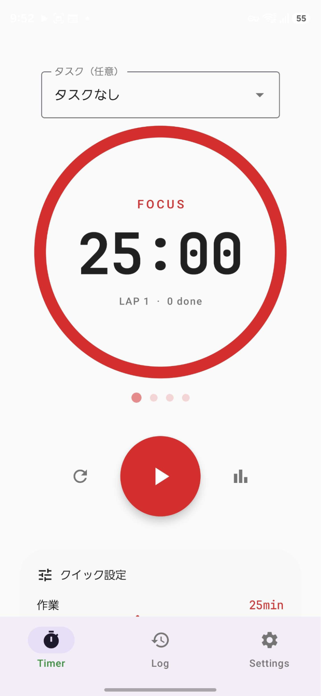
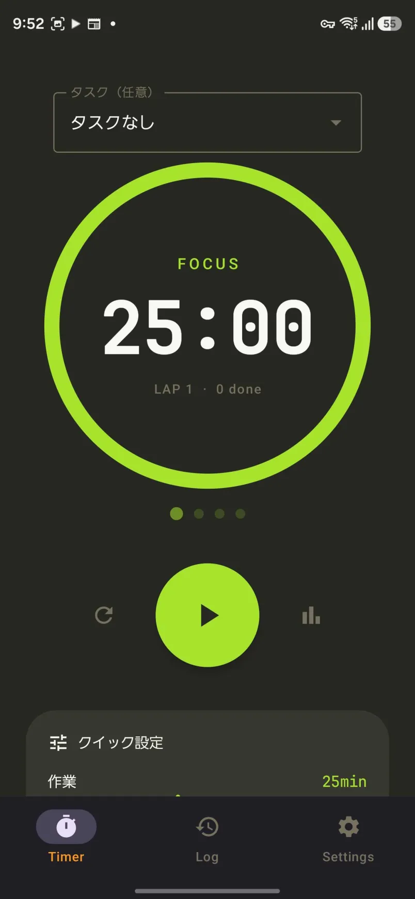
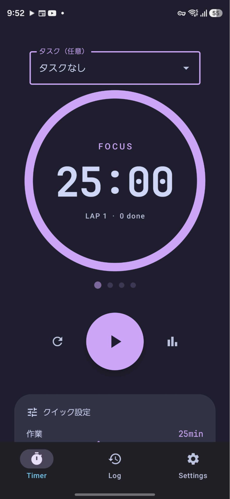
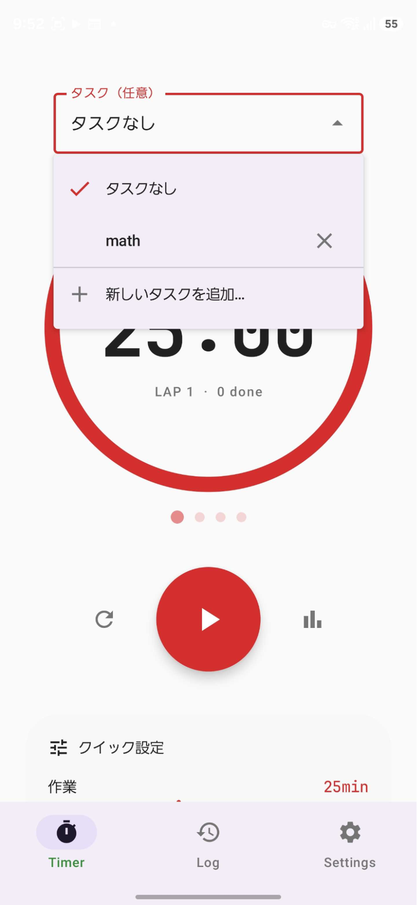
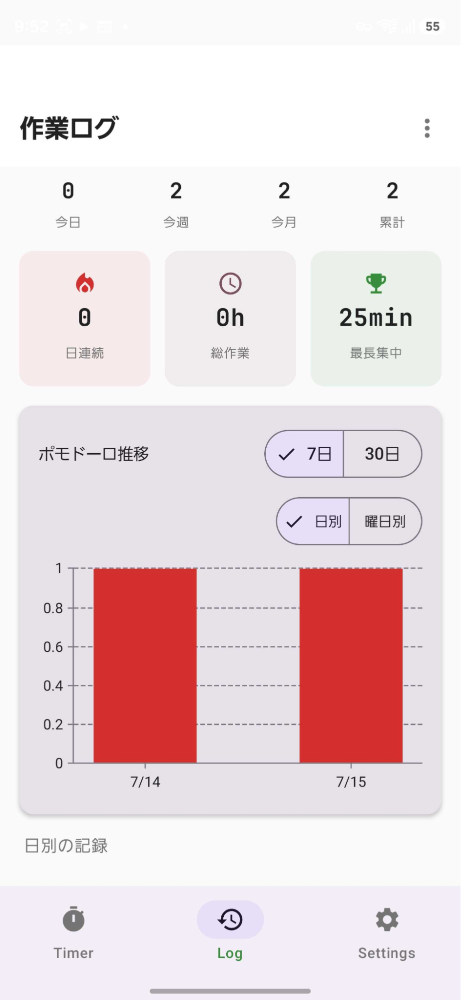
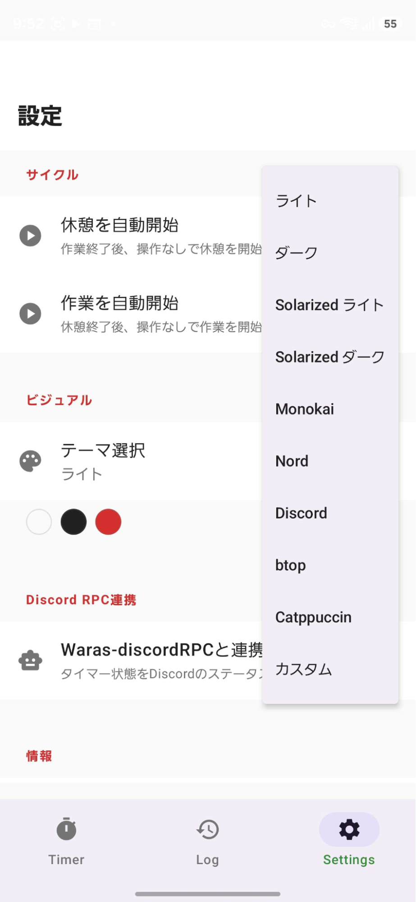
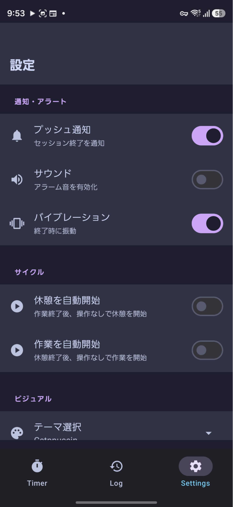
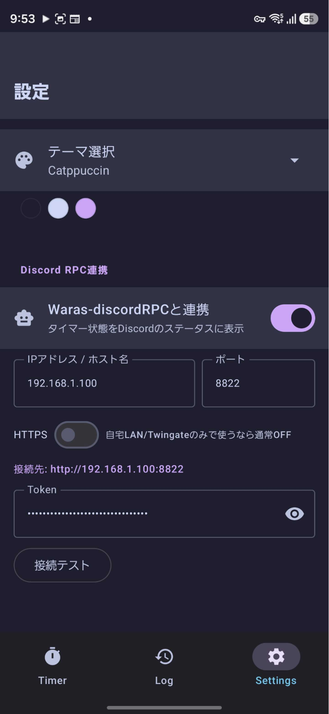

# 🍅 Pomotimer

ポモドーロ・テクニックに基づいた Android 集中管理タイマーアプリです。

<p align="center">
  
</p>

<p align="center">
  <a href="https://github.com/warasugitewara/Pomotimer/releases"></a>
  
  
  
  
</p>

---

## 📸 スクリーンショット

<table align="center">
  <tr>
    <td align="center" width="25%"><br/><sub><b>タイマー（ライト・デフォルト）</b></sub></td>
    <td align="center" width="25%"><br/><sub><b>タイマー（Monokai）</b></sub></td>
    <td align="center" width="25%"><br/><sub><b>タイマー（Catppuccin）</b></sub></td>
    <td align="center" width="25%"><br/><sub><b>タスクプリセット選択</b></sub></td>
  </tr>
  <tr>
    <td align="center" width="25%"><br/><sub><b>作業ログ</b></sub></td>
    <td align="center" width="25%"><br/><sub><b>テーマ選択</b></sub></td>
    <td align="center" width="25%"><br/><sub><b>通知・サイクル設定</b></sub></td>
    <td align="center" width="25%"><br/><sub><b>Discord RPC連携</b></sub></td>
  </tr>
</table>

---

## 📱 機能一覧

### ⏱ タイマー
- 作業時間・短休憩・長休憩の 3 モード自動切替
- バックグラウンドでも動作（フォアグラウンドサービス）
- タイマー状態を永続化。プロセスがシステムに回収されても進行状況・ポモドーロ数を復元
- タスク名のプリセット登録・ドロップダウン選択（「タスクなし」も選択可）
- ラップ数・完了ポモドーロ数・本日の作業時間をリアルタイム表示

### 🔔 通知
| 状態 | 表示 |
|------|------|
| 通知を折りたたんだとき | プログレスバーで残り時間を視覚化 |
| 通知を展開したとき | 残り時間・ラップ数・操作ボタン（再開 / 停止） |
| タイマー終了時 | プッシュ通知＋「アラームを停止」ボタン |

- タイマー終了時のアラーム音をアプリ内バナー or 通知ボタンで即時停止可能

### ⏰ ポモドーロサイクル
- 短休憩と長休憩を自動判定（デフォルト: 4 回ごとに長休憩）
- 作業 1〜60 分・短休憩 1〜60 分・長休憩 1〜120 分・長休憩間隔 2〜10 回まで調整可能
- 休憩/作業の自動開始 ON/OFF（操作なしで次のセッションへ自動遷移）
- タスク名を記録して作業ログ・Discord RPC 表示に反映（任意）

### 🎮 Discord RPC連携
- [Waras-discordRPC](https://github.com/warasugitewara/Waras-discordRPC) ブリッジと連携し、タイマー状態を Discord のステータスに表示
- 設定画面で ON/OFF・IPアドレス/ポート/HTTPS・Token・接続テストを設定可能
- 接続テストは成功 / 認証失敗 / 到達不能の3種類を判別して表示。ホスト入力はスキーム混入等を自動サニタイズ
- 一時停止中もキープアライブを再送し、ブリッジ側TTLによる表示消失を防止

### 📱 ホーム画面ウィジェット
- 残り時間・現在モードの確認、開始 / 一時停止 / リセット操作をアプリを開かずに実行（Jetpack Glance 製）

### 📋 作業ログ・可視化
- 作業・休憩セッションを自動記録（Room データベース）
- 日付ナビゲーション（← 前の日 | 日付 | 次の日 →）で過去のログを遡れる
- ログの個別削除・日単位削除・全削除（確認ダイアログ付き）
- 累計ポモドーロ数・総作業時間・連続記録日数のサマリー表示
- 日別ポモドーロ数の棒グラフ（7 日 / 30 日切り替え、[Vico](https://github.com/patrykandpatrick/vico) 製・テーマカラーに追従）

### 🔄 アプリ内アップデート
- 起動時に最新リリースを自動チェック
- 新バージョンがあればアプリ内で APK をダウンロード→インストール（ブラウザ遷移不要）

### 🎨 カラーテーマ
9 種類のプリセット + カスタムテーマに対応:

| テーマ | 特徴 |
|--------|------|
| ライト | 明るく清潔感のある標準テーマ |
| ダーク | 目に優しい暗色テーマ |
| Solarized ライト | 暖色ベースの Solarized 配色 |
| Solarized ダーク | 深い青緑をベースにした Solarized 配色 |
| Monokai | コードエディタで人気のダーク配色 |
| Nord | 北欧インスパイアの落ち着いた配色 |
| Discord | Discord ダークモードの見慣れたブラープル配色 |
| btop | ターミナルモニター風のネオングリーン×漆黒 |
| Catppuccin | パステルトーンの人気ダークテーマ (Mocha) |
| カスタム | 背景・テキスト・アクセント色を `#RRGGBB` で自由設定 |

### ⚙️ 設定
- **プッシュ通知** ON/OFF
- **通知音** ON/OFF
- **バイブレーション** ON/OFF
- **カラーテーマ** 選択＋カスタムカラー設定
- **タイマー時間** 作業 / 短休憩 / 長休憩 / 長休憩間隔

---

## 🏗 技術スタック

100% Kotlin・宣言的 UI・単方向データフロー（UDF）で構成しています。依存バージョンは [Version Catalog](gradle/libs.versions.toml)（`libs.versions.toml`）で一元管理しています。

| カテゴリ | 使用技術 |
|----------|----------|
| 言語 | Kotlin 2.2.0（K2 コンパイラ） + Kotlin Coroutines / Flow |
| UI | Jetpack Compose（BOM 2026.03.01）+ Material 3 + Material Icons Extended |
| アーキテクチャ | MVVM + 単方向データフロー（ViewModel + `StateFlow` + `collectAsStateWithLifecycle`） |
| バックグラウンド | `LifecycleService` によるフォアグラウンドサービス（`specialUse` タイプ、タイマー状態は DataStore に永続化しプロセス再生成時に復元） |
| データベース | Room 2.8.4（KSP 2.2.0-2.0.2 によるコンパイル時コード生成） |
| 設定・状態の永続化 | DataStore Preferences 1.2.1 |
| 画面遷移 | Navigation Compose 2.9.7 |
| グラフ | Vico 3.2.2 (compose + compose-m3) |
| ホーム画面ウィジェット | Jetpack Glance 1.1.1 |
| エッジツーエッジ表示 | Activity Compose 1.13.0（`enableEdgeToEdge`） |
| フォント | JetBrains Mono (OFL) |
| ビルドツール | Gradle 9.4.1 + AGP 8.13.2 + Version Catalog |
| 最小 SDK | Android 7.0 (API 24) |
| ターゲット SDK | Android 16 (API 36) |

---

## 📦 リリース

最新の APK は [Releases](https://github.com/warasugitewara/Pomotimer/releases) からダウンロードできます。

| バージョン | 主な変更 |
|-----------|----------|
| [v1.7.1](https://github.com/warasugitewara/Pomotimer/releases/tag/v1.7.1) | Doze中でもAlarmManagerでセッション終了を確実に検知するよう修正・ウィジェットの再描画を毎秒から節目/1分間隔に抑制・リセットや停止で中断したセッションを未完了として記録・停止時とプロセス再生成直後のウィジェット表示不整合を修正 |
| [v1.7.0](https://github.com/warasugitewara/Pomotimer/releases/tag/v1.7.0) | **一時停止を挟むと作業実績時間が過少計上される不具合を修正**（一時停止からの再開ではセッション開始点を動かさないよう修正）・別アプリや別画面を見ている間にタイマーがリセットされる不具合を修正（タイマー状態を永続化し、プロセス再生成時に自動復元）・クイック設定の作業スライダーが進行中セッションをリセットしてしまう問題を修正・タスク名のプリセット登録＆ドロップダウン選択機能を追加・Discord RPC接続テストの3値化（成功/認証失敗/到達不能）とホスト入力のサニタイズ・一時停止中のキープアライブ送信を追加 |
| [v1.6.3](https://github.com/warasugitewara/Pomotimer/releases/tag/v1.6.3) | Discord RPC 連携が平文HTTP通信をブロックされ接続できない不具合を修正（`usesCleartextTraffic`追加）。設定画面のBridge設定をIPアドレス/ポート/HTTPSの分離入力に変更し、接続先をわかりやすく表示 |
| [v1.6.2](https://github.com/warasugitewara/Pomotimer/releases/tag/v1.6.2) | **パッケージ名を `com.example.pomodoro` → `com.warasugi.pomotimer` に変更**（旧バージョンからの自動更新は不可。アンインストール後に再インストールが必要）・作業時間の上限を 60 分に調整 |
| [v1.6.1](https://github.com/warasugitewara/Pomotimer/releases/tag/v1.6.1) | ホーム画面ウィジェットからタイマーを開始すると残り時間が進まない不具合を修正 |
| [v1.6.0](https://github.com/warasugitewara/Pomotimer/releases/tag/v1.6.0) | Discord RPC 連携・ホーム画面ウィジェット・ポモドーロサイクル設定強化（自動開始・範囲拡張）・統計強化（期間別サマリ・最長集中時間・曜日別グラフ）・タスク名記録・クレジット画面の情報ハブ化 |
| [v1.5.0](https://github.com/warasugitewara/Pomotimer/releases/tag/v1.5.0) | タイマー画面 UI/UX 刷新（JetBrains Mono 表示・呼吸するリング・サイクルドット）・ログ画面に Vico グラフと累計サマリーを追加・アプリ内 DL → インストールでのアップデート対応 |
| [v1.4.0](https://github.com/warasugitewara/Pomotimer/releases/tag/v1.4.0) | Discord・btop・Catppuccin テーマ追加・起動時アップデート通知・署名を pomotimer.warasugi.com に統一・**APK 署名修正**（v1.3.1 以前から更新する場合はアンインストール後に再インストールが必要です） |
| [v1.3.1](https://github.com/warasugitewara/Pomotimer/releases/tag/v1.3.1) | ロック画面への通知表示・設定画面にクレジット追加 |
| [v1.3.0](https://github.com/warasugitewara/Pomotimer/releases/tag/v1.3.0) | Material3 UI/UX 最適化 |
| [v1.2.0](https://github.com/warasugitewara/Pomotimer/releases/tag/v1.2.0) | 長休憩・バイブ・6 テーマ＋カスタム・アラーム停止・作業ログ管理・ドット絵アイコン |
| [v1.1.0](https://github.com/warasugitewara/Pomotimer/releases/tag/v1.1.0) | バックグラウンド動作・通知・作業ログ・設定画面 |
| [v1.0.0](https://github.com/warasugitewara/Pomotimer/releases/tag/v1.0.0) | 初回リリース |

---

## 🚀 ビルド方法

```bash
# リポジトリをクローン
git clone https://github.com/warasugitewara/Pomotimer.git
cd Pomotimer

# デバッグ APK をビルド
./gradlew assembleDebug

# リリース APK をビルド（署名設定は local.properties で指定）
./gradlew assembleRelease
```

必要環境:

- Android SDK Platform 36（Android 16）
- JDK 17 以上（Gradle 9.4.1 / AGP 8.13.2 の要件）

※ 私は開発に GraalVM 25 を使用しているのでそちらが一番安定するかもしれません

---

## 📂 プロジェクト構成

```
app/src/main/java/com/example/pomodoro/
├── data/
│   ├── AppDatabase.kt        # Room データベース
│   ├── WorkLog.kt            # 作業ログエンティティ
│   ├── WorkLogDao.kt         # DAO（日付別クエリ・削除）
│   └── SettingsRepository.kt # DataStore ラッパー（設定・タスク名プリセット・タイマー状態スナップショット）
├── model/
│   └── TimerState.kt         # タイマー状態データクラス
├── service/
│   └── TimerService.kt       # フォアグラウンドサービス（タイマー・通知・音声・振動・状態の永続化/復元）
├── ui/
│   ├── theme/
│   │   ├── AppTheme.kt       # 10 テーマ定義 + PomotimerTheme
│   │   └── Type.kt           # JetBrains Mono タイポグラフィ
│   ├── PomotimerApp.kt       # NavHost + BottomNavigation + アップデートダイアログ
│   ├── TimerScreen.kt        # タイマー画面
│   ├── WorkLogScreen.kt      # 作業ログ画面（サマリー + グラフ）
│   ├── StatsChart.kt         # Vico 製の日別ポモドーロ棒グラフ
│   ├── SettingsScreen.kt     # 設定画面
│   └── widget/
│       ├── PomotimerWidget.kt         # Jetpack Glance ホーム画面ウィジェット
│       └── PomotimerWidgetReceiver.kt
├── util/
│   ├── UpdateChecker.kt      # GitHub Releases から最新版・APK URL を取得
│   ├── ApkInstaller.kt       # APK ダウンロード + インストール起動
│   └── DiscordRpcReporter.kt # Waras-discordRPC ブリッジへの presence 送信
├── viewmodel/
│   └── TimerViewModel.kt     # ViewModel（サービス委譲 + DataStore + 統計）
└── MainActivity.kt
```

---

## 📄 ライセンス

[LICENSE](LICENSE) を参照してください。
